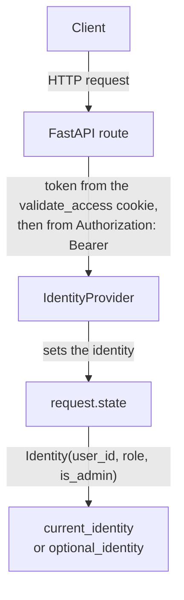
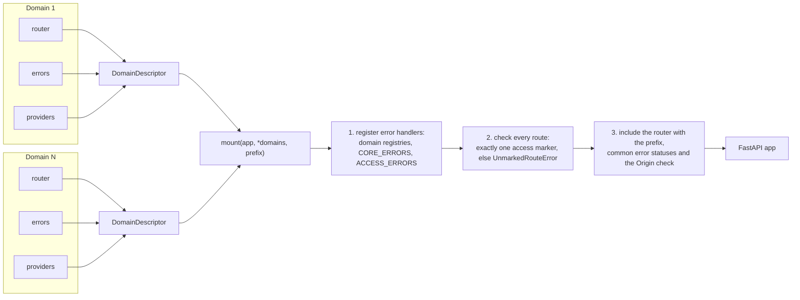

# vld-web

Shared HTTP layer. Everything that belongs to FastAPI but to no domain: who may
call a route, what an error looks like, how a domain is mounted, how rate limits
apply and what a list page looks like.

## What's inside

```
access/        access markers, session cookies, Origin check, identity
errors/        single error form, error registries, handlers, X-Request-Id
mounting/      DomainDescriptor and mount(): a domain is connected by one object
throttling/    rate limits by client address on top of vld.core.ratelimit
pagination/    TablePage: limit/offset page with total
```

## `access/` — who may call a route

Every route declares exactly one marker in `dependencies=[...]`:

| Marker | Who may call the route |
|---|---|
| `public()` | anyone, no token |
| `authenticated()` | any signed-in user |
| `roles("student", ...)` | a user with one of the roles |
| `staff("teacher", ...)` | a user with one of the roles, or with the admin flag |
| `admin()` | only a user with the admin flag, whatever the role |
| `self_authenticated()` | a route that checks its own credential |

A marker is the check itself:



- The token is read from the `validate_access` cookie first, then from the
  `Authorization: Bearer` header.
- `IdentityProvider` is a port: the users domain implements it and provides it
  through dishka.
- The identity lands in `request.state`; a route reads it with `current_identity`,
  a public route with `optional_identity`, which never refuses.
- `require_same_origin` refuses a mutating request from an origin that is not in
  `MIDDLEWARE_CORS_ALLOWED_ORIGINS`, and a request that carries session cookies
  without any origin. An admin panel is one more entry in that list.

## `errors/` — the error form

Any error from any domain has one shape (`ErrorResponse`):

```json
{
  "error": "users.invalid_credentials",
  "message": "Неверная почта или пароль.",
  "details": null,
  "request_id": "3f2b9c..."
}
```

- `ErrorSpec(status, code, message)` — how one error looks from outside.
- `ErrorRegistry(base, mapping, fallback_code)` — the table "domain exception →
  ErrorSpec". Each domain declares its own in `api/_errors.py`.
- `CORE_ERRORS` (rate limit: 429 with `Retry-After`) and `ACCESS_ERRORS` (401, 403).
- `register_error_handlers` installs the handlers: domain registries, validation
  errors (422 with `details` per field), `HTTPException`, and everything
  unexpected (500 without details outside, full traceback in the log).
- `RequestIdMiddleware` gives the request an `X-Request-Id` (or keeps a well-formed
  incoming one), binds it to the log context and returns it in the response.
- `safe_exc_info` keeps the text of a database driver error out of the log when it
  carries the bound query parameters (personal data).

Error messages are the text users read, so they stay in Russian.

## `mounting/` — connecting a domain

A domain exposes one `DomainDescriptor`:

```python
USERS_DOMAIN = DomainDescriptor(
    router=router,  # APIRouter of the domain with all its sub-routers
    errors=USERS_ERRORS,  # error registry of the domain
    providers=(...),  # dishka providers of the domain
    on_startup=startup,  # optional check at startup
)
```

`mount(app, *domains, prefix="/api/v1")`:



`mount` does not touch providers: `apps/api` collects them from the descriptors
into its container.

## `throttling/` — rate limits by client address

- `client_ip(request)` — the client address from `request.client`. It is the real
  address because uvicorn runs with `--proxy-headers` and trusts
  `X-Forwarded-For` only from the reverse proxy.
- `throttle_by_ip(limiter, request, bucket, limit, window_ms)` — refuses with 429
  over the limit and when Redis is down.
- `throttle_by_ip_fail_open(...)` — the same, but lets the request through when
  Redis is down. For public reads, where a Redis outage must not take the page
  down.
- `ThrottlingProvider` builds the `Limiter` on the Redis client from
  `CoreProvider`.

Each domain keeps its own thresholds in `api/_throttle.py`.

## `pagination/` — pages in responses

`TablePage[T]`: `limit`/`offset` (limit up to 100, offset up to 1000) with
`total`, for lists a person pages through: journals, specialities, staff tables.
Built on `fastapi-pagination`.

## How it is connected

It connects nothing itself. Domains import markers, error registries, page types
and `DomainDescriptor`; `apps/api` calls `mount()` and adds `ThrottlingProvider`.

## Tests

`packages/web/tests/`: markers and session cookies, optional identity, the Origin
check, the error form and the core error registry, throttling, the limiter
provider, the table page.
